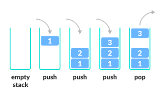

# Stack

* Last in first out (LIFO)
* operations
  * push: Add an element to the top of a stack
  * pop: Remove an element from the top of a stack
  * isFull: Check if the stack is empty
  * isEmpty: Check if the stack is full
  * peek: Get the value of the top element without removing it
* complexity of push and pop operations take constant time, i.e. O(1)
