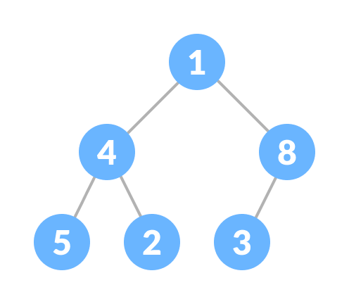

# Heap

* Heap data structure is a complete binary tree that satisfies **the heap property**. It is also called as **a binary heap**.
* A complete binary tree is a special binary tree in which

  * every level, except possibly the last, is filled
  * all the nodes are as far left as possible
* Heap Property is the property of a node in which

  * (for max heap) key of each node is always greater than its child node/s and the key of the root node is the largest among all other nodes;
  * (for min heap) key of each node is always smaller than the child node/s and the key of the root node is the smallest among all other nodes.
* operations

  * heafify
  * insert element in heap
  * delete element in heap
  * peek
  * extract min/max : Extract-Max returns the node with maximum value after removing it from a Max Heap whereas Extract-Min returns the node with minimum after removing it from Min Heap.
