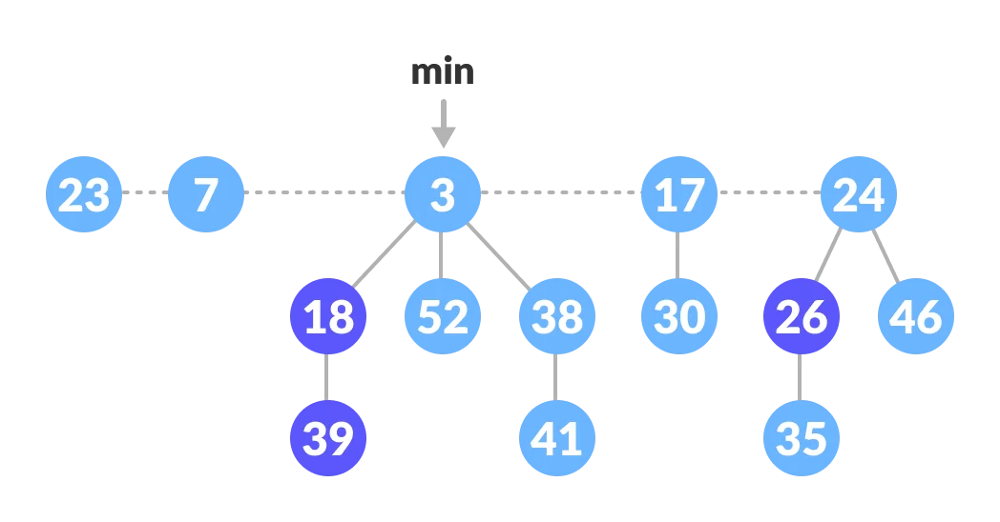

# Fibonacci Heap

* The fibonacci heap is called a **fibonacci** heap because the trees are constructed in a way such that a tree of order n has at least `Fn+2`nodes in it, where`Fn+2`is the`(n + 2)nd` Fibonacci number.
* properties
  * It is a set of **min heap-**[**ordered**](https://cs.lmu.edu/~ray/notes/orderedtrees/) trees. (i.e. The parent is always smaller than the children.)
  * A pointer is maintained at the minimum element node.
  * It consists of a set of marked nodes. (Decrease key operation)
  * The trees within a Fibonacci heap are unordered but [rooted](https://mathworld.wolfram.com/RootedTree.html).
* operations
  * insertion
  * find min
  * union
  * extract min
  * deleting key and node
*
