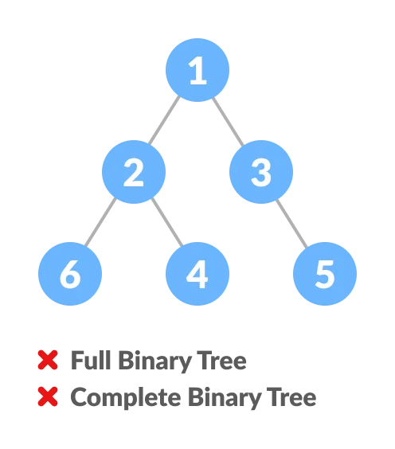
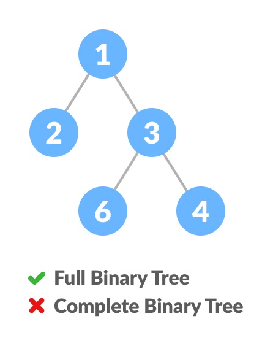
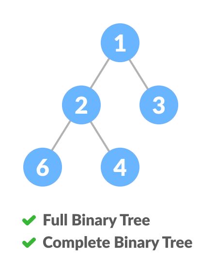

# Complete Binary Tree

## Complete Binary Tree VS Full Binary Tree

  

## Creating Complete Binary Tree

* Select the first element of the list to be the root node. (no. of elements on level-I: 1)
* Put the second element as a left child of the root node and the third element as the right child. (no. of elements on level-II: 2)
* Put the next two elements as children of the left node of the second level. Again, put the next two elements as children of the right node of the second level (no. of elements on level-III: 4) elements).
* Keep repeating until you reach the last element.

## Relationship between array indexes and tree element

A complete binary tree has an interesting property that we can use to find the children and parents of any node.

If the index of any element in the array is i, the element in the index `2i+1` will become the left child and element in `2i+2` index will become the right child. Also, the parent of any element at index i is given by the lower bound of `(i-1)/2`.

## Applications

* Heap-based data structures
* [Heap sort](https://www.programiz.com/dsa/heap-sort)
