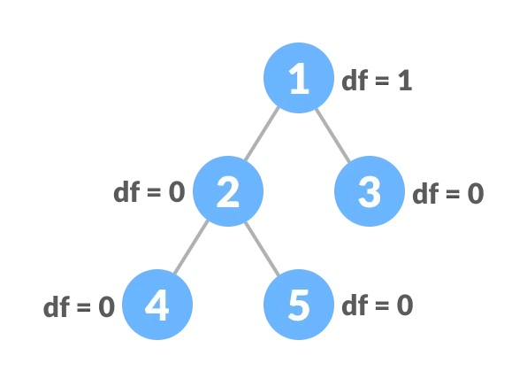
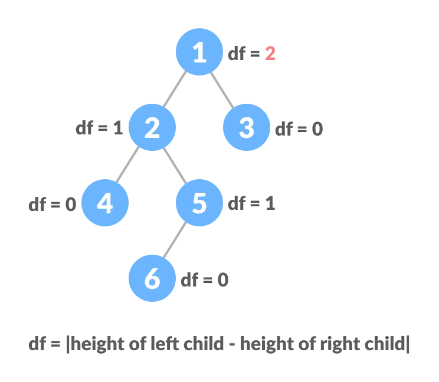

# Balanced Binary Tree

balanced:

unbalanced:

* A balanced binary tree, also referred to as a height-balanced binary tree, is defined as a binary tree in which the height of the left and right subtree of any node differ by not more than 1.
* Following are the conditions for a height-balanced binary tree:
  * difference between the left and the right subtree for any node is not more than one
  * the left subtree is balanced
  * the right subtree is balanced

## Applications

* [AVL tree](https://www.programiz.com/dsa/avl-tree)
* Balanced [Binary Search Tree](https://www.programiz.com/dsa/binary-search-tree)
