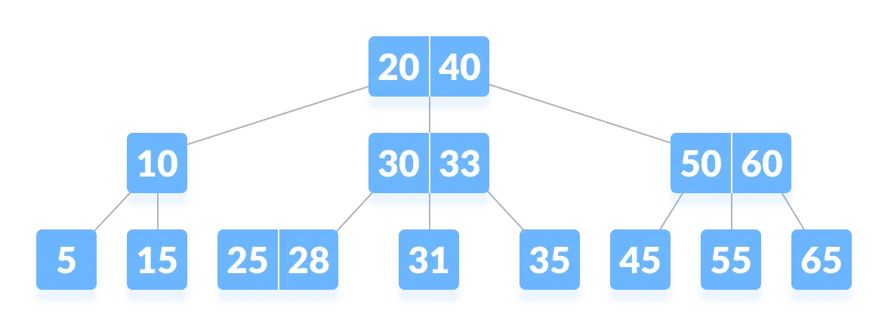

# B-Tree *or* B Tree

B-tree is a special type of self-balancing search tree in which each node can contain more than one key and can have more than two children. It is a generalized form of the [binary search tree](https://www.programiz.com/dsa/binary-search-tree).

It is also known as a height-balanced m-way tree.

## Properties

* For each node x, the keys are stored in increasing order.
* In each node, there is a boolean value x.leaf which is true if x is a leaf.
* If n is the order of the tree, each internal node can contain at most `n - 1` keys along with a pointer to each child.
* Each node except root can have at most n children and at least `n/2` children.
* All leaves have the same depth (i.e. height-h of the tree).
* The root has at least 2 children and contains a minimum of 1 key.
* If `n ≥ 1`, then for any n-key B-tree of height h and minimum degree `t ≥ 2`, `h ≥ logt (n+1)/2`.

## Operations

* Searching
* insertion
* deletion

## Complexity

* delete

  * Best case Time complexity: `Θ(log n)`
  * Average case Space complexity: `Θ(n)`
  * Worst case Space complexity: `Θ(n)`
* search

  * Worst case Time complexity: `Θ(log n)`
  * Average case Time complexity: `Θ(log n)`
  * Best case Time complexity: `Θ(log n)`
  * Average case Space complexity: `Θ(n)`
  * Worst case Space complexity: `Θ(n)`

## Applications

* databases and file systems
* to store blocks of data (secondary storage media)
* multilevel indexing
