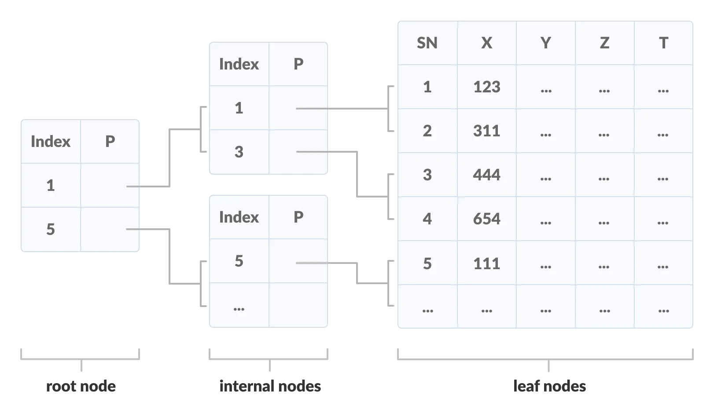
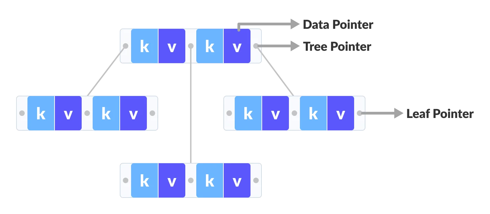
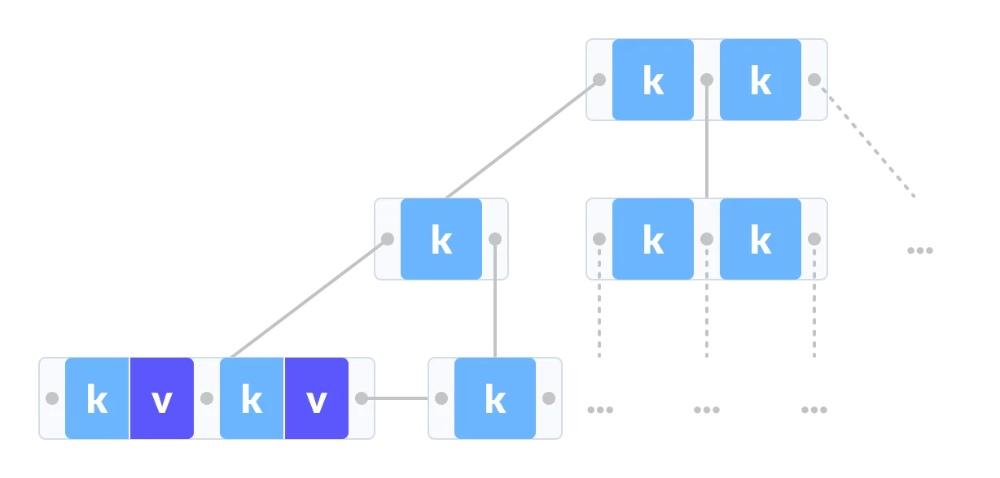

# B+ Tree

A B+ tree is an advanced form of a self-balancing tree in which all the values are present in the leaf level.

An important concept to be understood before learning B+ tree is multilevel indexing. In multilevel indexing, the index of indices is created as in figure below. It makes accessing the data easier and faster.

## Properties

* All leaves are at the same level.
* The root has at least two children.
* Each node except root can have a maximum of m children and at least `m/2` children.
* Each node can contain a maximum of `m - 1` keys and a minimum of `⌈m/2⌉ - 1` keys.

## B- Tree *VS* B+ Tree

B- tree

B+ Tree 

## Time Complexity

* Search

  * If linear search is implemented inside a node, then total complexity is `Θ(logt n)`.
  * If binary search is used, then total complexity is `Θ(log2t.logt n)`.
* Insert

  * Time complexity: `Θ(t.logt n)`
  * The complexity is dominated by `Θ(logt n)`.

## Applications

* Multilevel Indexing
* Faster operations on the tree (insertion, deletion, search)
* Database indexing
