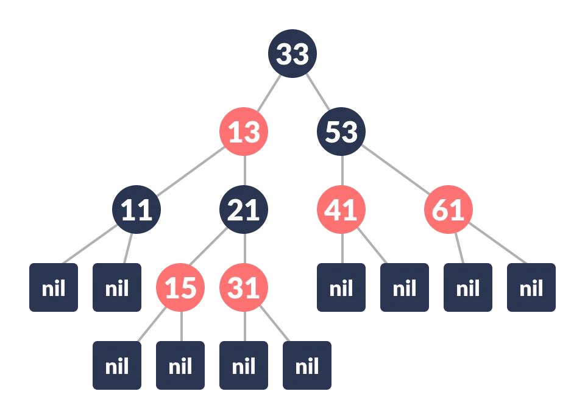

# Red Black Tree

Red-Black tree is a self-balancing binary search tree in which each node contains an extra bit for denoting the color of the node, either red or black.

A red-black tree satisfies the following properties:

1. **Red/Black Property:** Every node is colored, either red or black.
2. **Root Property:** The root is black.
3. **Leaf Property:** Every leaf (NIL) is black.
4. **Red Property:** If a red node has children then, the children are always black.
5. **Depth Property:** For each node, any simple path from this node to any of its descendant leaf has the same black-depth (the number of black nodes).

Each node has the following attributes:

* color
* key
* leftChild
* rightChild
* parent (except root node)

## Operations

* rotating the subtrees
  * left rotate
  * right rotate
  * left-right and right-left rotate
* insert
* maintain the balance
* deleting an element

## Applications

* To implement finite maps
* To implement Java packages: `java.util.TreeMap` and `java.util.TreeSet`
* To implement Standard Template Libraries (STL) in C++: multiset, map, multimap
* In Linux Kernel
