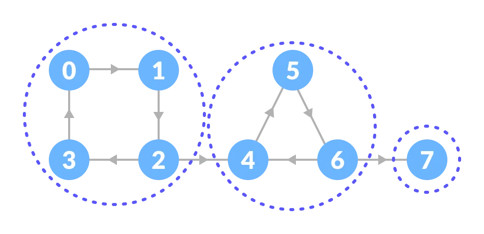

# Strongly Connected Graph

A strongly connected component is the portion of a directed graph in which there is a path from each vertex to another vertex. **It is applicable only on** [**a directed graph**](https://www.programiz.com/dsa/graph).

These components can be found using **Kosaraju's Algorithm**.

## Applications

* Vehicle routing applications
* Maps
* Model-checking in formal verification
