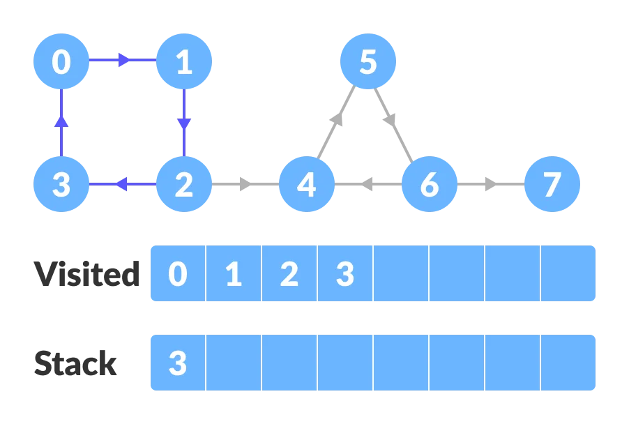

# Kosaraju's Algorithm

Kosaraju's Algorithm is based on [the depth-first search algorithm](https://www.programiz.com/dsa/graph-dfs) implemented twice.

## Complexity

Kosaraju's algorithm runs in linear time i.e. `O(V+E)`.
