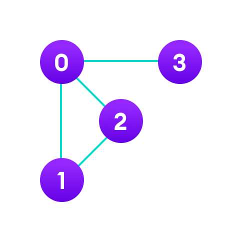

# Adjacency Matrix

An adjacency matrix is a way of representing a graph as a matrix of booleans (0's and 1's). A finite graph can be represented in the form of a square matrix on a computer, where the boolean value of the matrix indicates if there is a direct path between two vertices.

Each cell in the above table/matrix is represented as `Aij`, where `i` and `j` are vertices. The value of `Aij` is either 1 or 0 depending on whether there is an edge from vertex `i` to vertex `j`.

If there is a path from `i` to `j`, then the value of `Aij` is 1 otherwise its 0. For instance, there is a path from vertex 1 to vertex 2, so `A12` is 1 and there is no path from vertex 1 to 3, so `A13` is 0.

In case of undirected graphs, the matrix is symmetric about the diagonal because of every edge `(i,j)`, there is also an edge `(j,i)`.

## Pros of Adjacency Matrix

* The basic operations like adding an edge, removing an edge and checking whether there is an edge from vertex i to vertex j are extremely time efficient, constant time operations.
* If the graph is dense and the number of edges is large, an adjacency matrix should be the first choice. Even if the graph and the adjacency matrix is sparse, we can represent it using data structures for sparse matrices.

## Cons of Adjacency Matrix

* The biggest advantage however, comes from the use of matrices. The recent advances in hardware enable us to perform even expensive matrix operations on the GPU.
* By performing operations on the adjacent matrix, we can get important insights into the nature of the graph and the relationship between its vertices.

## Applications

* The `VxV` space requirement of the adjacency matrix makes it a memory hog. Graphs out in the wild usually don't have too many connections and this is the major reason why [adjacency lists](https://www.programiz.com/dsa/graph-adjacency-list) are the better choice for most tasks.
* While basic operations are easy, operations like `inEdges` and `outEdges` are expensive when using the adjacency matrix representation.
* Creating routing table in networks
* Navigation tasks
