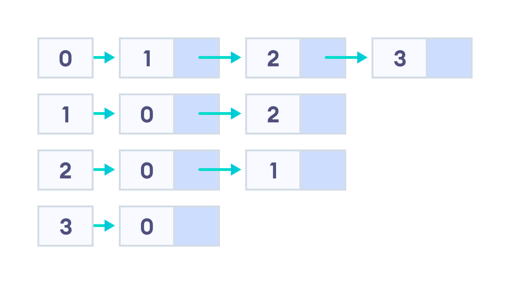

# Adjacency List

 

An adjacency list represents a graph as an array of linked lists. The index of the array represents a vertex and each element in its linked list represents the other vertices that form an edge with the vertex.

Here, **0**, **1**, **2**, **3** are the vertices and each of them forms a linked list with all of its adjacent vertices. For instance, vertex 1 has two adjacent vertices 0 and 2. Therefore, 1 is linked with 0 and 2 in the figure above.

## Pros of Adjacency List

* An adjacency list is efficient in terms of storage because we only need to store the values for the edges. For a sparse graph with millions of vertices and edges, this can mean a lot of saved space.
* It also helps to find all the vertices adjacent to a vertex easily.

---

## Cons of Adjacency List

* Finding the adjacent list is not quicker than the adjacency matrix because all the connected nodes must be first explored to find them.

## Applications

* It is faster to use adjacency lists for graphs having less number of edges.
