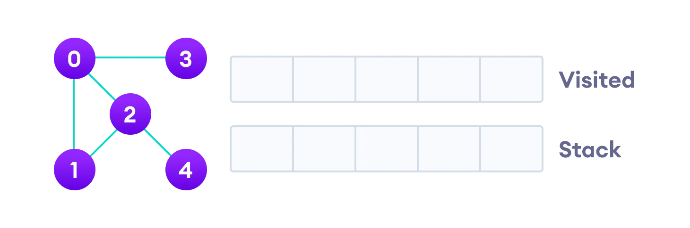

# Depth First Search

Depth first Search or Depth first traversal is a recursive algorithm for searching all the vertices of a graph or tree data structure. Traversal means visiting all the nodes of a [graph](https://www.programiz.com/dsa/graph).

## Complexity of Depth First Search

The time complexity of the DFS algorithm is represented in the form of `O(V + E)`, where `V` is the number of nodes and `E` is the number of edges.

The space complexity of the algorithm is `O(V)`.

---

## Application of DFS Algorithm

1. For finding the path
2. To test if the graph is bipartite
3. For finding the strongly connected components of a graph
4. For detecting cycles in a graph
