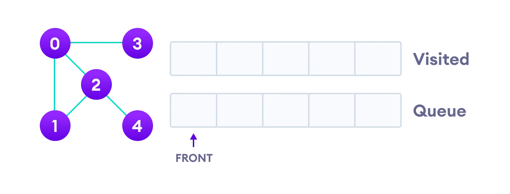

# Breadth first search

Traversal means visiting all the nodes of a graph. Breadth First Traversal or Breadth First Search is a recursive algorithm for searching all the vertices of a graph or tree data structure.

## BFS Algorithm Complexity

The time complexity of the BFS algorithm is represented in the form of `O(V + E)`, where V is the number of nodes and E is the number of edges.

The space complexity of the algorithm is `O(V)`.

## BFS Algorithm Applications

1. To build index by search index
2. For GPS navigation
3. Path finding algorithms
4. In Ford-Fulkerson algorithm to find maximum flow in a network
5. Cycle detection in an undirected graph
6. In [minimum spanning tree](https://www.programiz.com/dsa/spanning-tree-and-minimum-spanning-tree)
