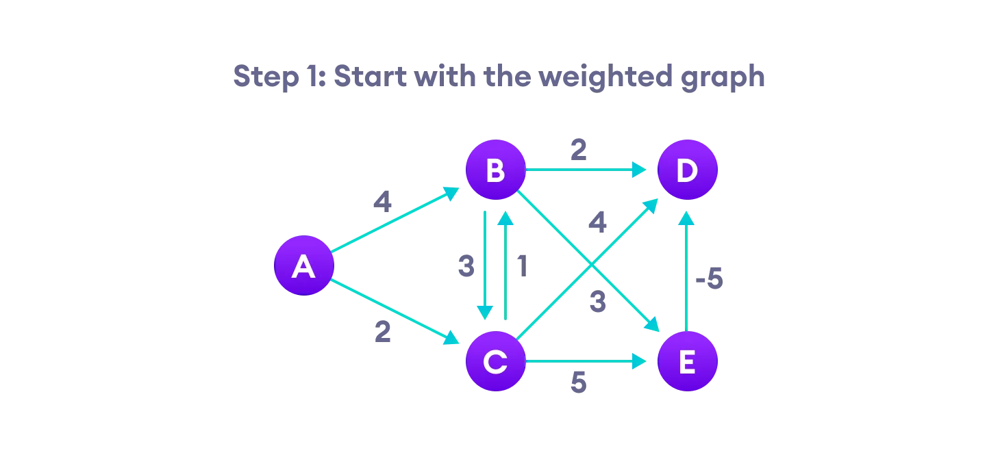
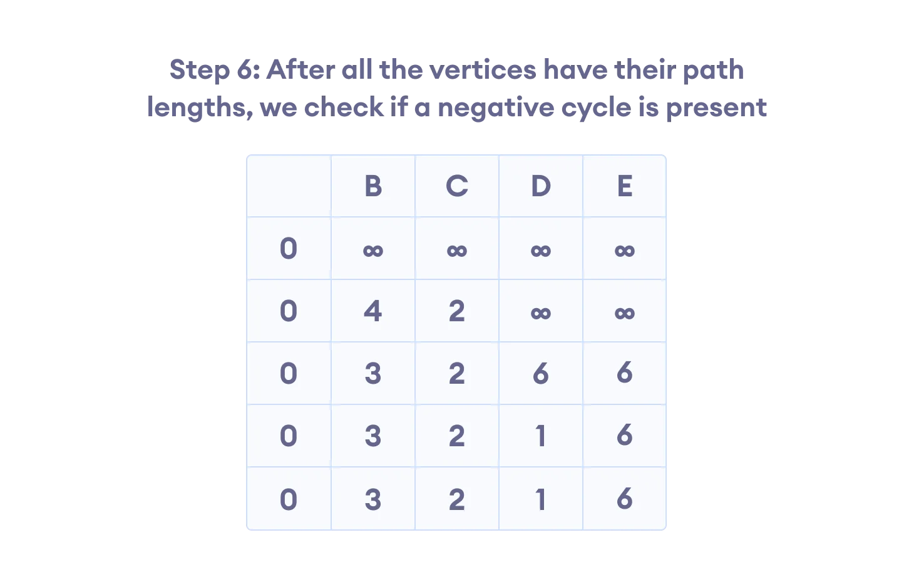
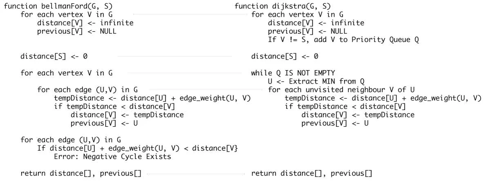

# Bellman Ford's Algorithm

It is similar to [Dijkstra's algorithm](https://www.programiz.com/dsa/dijkstra-algorithm) but it can work with graphs in which edges can have negative weights.

## Why would one ever have edges with negative weights in real life?

Negative weight edges might seem useless at first but they can explain a lot of phenomena like cashflow, the heat released/absorbed in a chemical reaction, etc.

For instance, if there are different ways to reach from one chemical A to another chemical B, each method will have sub-reactions involving both heat dissipation and absorption.

If we want to find the set of reactions where minimum energy is required, then we will need to be able to factor in the heat absorption as negative weights and heat dissipation as positive weights.

## Why do we need to be careful with negative weights?

Negative weight edges can create negative weight cycles i.e. a cycle that will reduce the total path distance by coming back to the same point.

## Bellman Ford vs Dijkstra

Bellman Ford's algorithm and Dijkstra's algorithm are very similar in structure. While Dijkstra looks only to the immediate neighbors of a vertex, Bellman goes through each edge in every iteration.

## Bellman Ford's Complexity

### Time Complexity

| Best Case Complexity | O(E) |
| - | - |
| Average Case Complexity | O(VE) |
| Worst Case Complexity | O(VE) |

### Space Complexity

And, the space complexity is `O(V)`.

---

## Bellman Ford's Algorithm Applications

1. For calculating shortest paths in routing algorithms
2. For finding the shortest path
