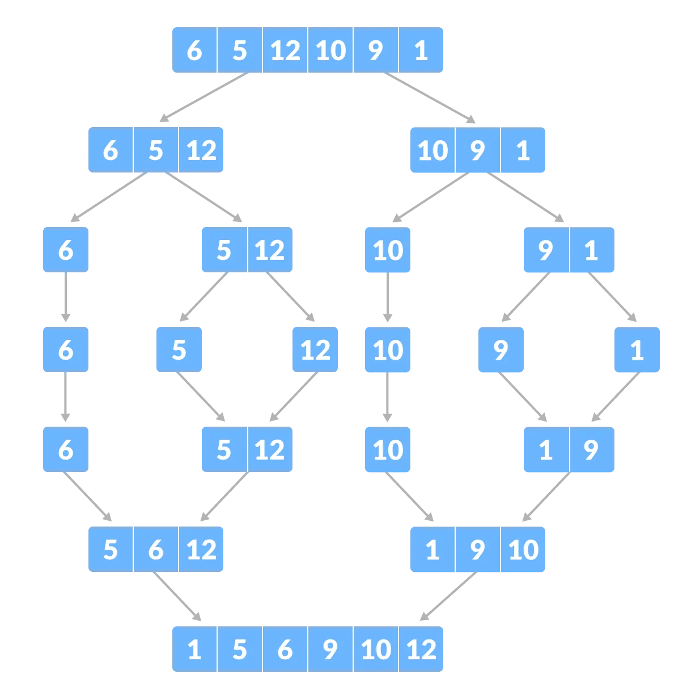

# Merge Sort Algorithm

Merge Sort is one of the most popular [sorting algorithms](https://www.programiz.com/dsa/sorting-algorithm) that is based on the principle of [Divide and Conquer Algorithm](https://www.programiz.com/dsa/divide-and-conquer).

Here, a problem is divided into multiple sub-problems. Each sub-problem is solved individually. Finally, sub-problems are combined to form the final solution.

## Divide and Conquer Strategy

Using the **Divide and Conquer** technique, we divide a problem into subproblems. When the solution to each subproblem is ready, we 'combine' the results from the subproblems to solve the main problem.

Suppose we had to sort an array A. A subproblem would be to sort a sub-section of this array starting at index p and ending at index r, denoted as A[p..r].

**Divide**

If q is the half-way point between p and r, then we can split the subarray A[p..r] into two arrays A[p..q] and A[q+1, r].

**Conquer**

In the conquer step, we try to sort both the subarrays A[p..q] and A[q+1, r]. If we haven't yet reached the base case, we again divide both these subarrays and try to sort them.

**Combine**

When the conquer step reaches the base step and we get two sorted subarrays A[p..q] and A[q+1, r] for array A[p..r], we combine the results by creating a sorted array A[p..r] from two sorted subarrays A[p..q] and A[q+1, r].

## Complexity

| **Time Complexity** |   |
| - | - |
| Best | O(n*log n) |
| Worst | O(n*log n) |
| Average | O(n*log n) |
| **Space Complexity** | O(n) |
| **Stability** | Yes |

## Applications

* Inversion count problem
* External sorting
* E-commerce applications

## Similar Sorting Algorithms

1. [Quicksort](https://www.programiz.com/dsa/quick-sort)
2. [Insertion Sort](https://www.programiz.com/dsa/insertion-sort)
3. [Selection Sort](https://www.programiz.com/dsa/selection-sort)
4. [Bucket Sort](https://www.programiz.com/dsa/bucket-sort)
